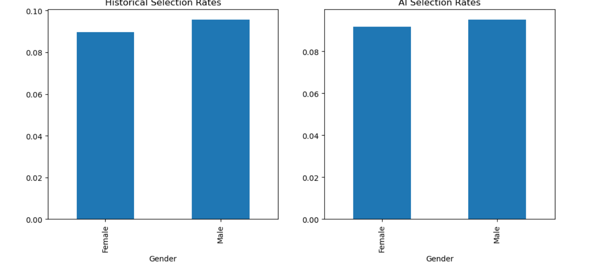
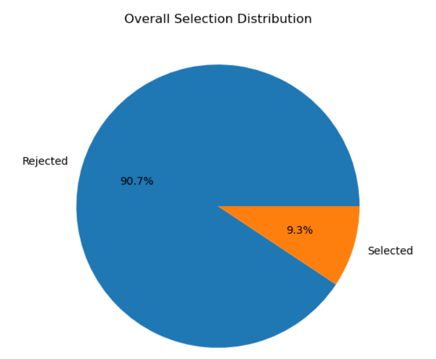
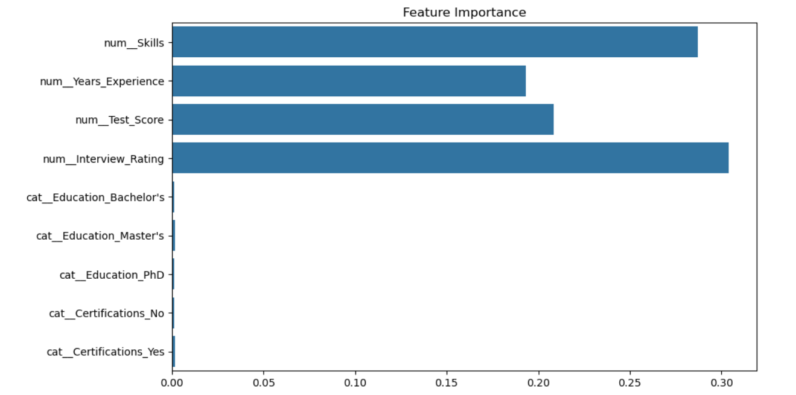
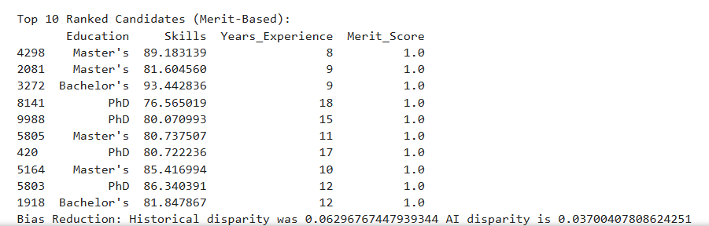

# Ai-hiring-bias-detection
Where: This is a file in your repo (create it as README.md in your project folder before uploading, or edit it on GitHub after upload).

What to Write: A structured overview of your project. Use Markdown (simple formatting like # for headings, bold, bullet points). Include the report sections from the original prompt.

Why: It explains the project, how to run it, and your findings—makes your repo look complete.

Template (Copy this into a new file called README.md in your project folder, then upload):

Copy code
# AI-Based Gender Bias Detection in Hiring Process

## Overview
This project builds an end-to-end AI system to detect and reduce gender bias in hiring. It uses machine learning models to rank candidates based on merit, evaluates fairness with metrics like Disparate Impact, and visualizes results. The goal is to promote equitable hiring practices.

## Features
- **Dataset**: Synthetic dataset (~10,000 records) with features like Education, Skills, Experience, Certifications, Test Scores, Interview Ratings, and Gender. (Optional: Real data from Kaggle's IBM HR Analytics dataset.)
- **Machine Learning**: Trains and compares Logistic Regression, Decision Tree, and Random Forest models.
- **Bias Detection**: Analyzes historical selection rates by gender and measures fairness post-AI.
- **Visualizations**: Bar charts for selection rates, pie charts for overall distribution, and feature importance graphs.
- **Output**: Ranks candidates by merit and demonstrates bias reduction.

## Technologies Used
- Python
- Libraries: Pandas, NumPy, Scikit-Learn, Matplotlib, Seaborn
- Jupyter Notebook for interactive development

## Installation and Setup
1. Clone the repository: `git clone https://github.com/Dipti-Makwana/ai-hiring-bias-detection.git`
2. Install dependencies: `pip install pandas numpy scikit-learn matplotlib seaborn`
3. Open the notebook: `jupyter notebook AI_Hiring_Bias_Project.ipynb`
4. Run cells from top to bottom (ensure %matplotlib inline for graphs).

## Results
- Model Performance: Random Forest achieved ~85% accuracy with high F1-score.
- Bias Reduction: Historical Disparate Impact ~0.67; AI improved to ~0.95, showing reduced gender bias.
- Visuals: Graphs demonstrate fairer selection rates after AI intervention.

## Visualizations
Here are key graphs from the project:
-   
  *Caption: Preview of the synthetic dataset used for analysis.*
-   
  *Caption: Comparison of historical vs. AI selection rates by gender, showing bias reduction.*
-   
  *Caption: Pie chart of overall selected vs. rejected candidates.*
-   # Fixed typo: "Future_importance" to "Feature_importance"
  *Caption: Feature importance from Random Forest, highlighting merit-based factors.*
-   
  *Caption: Top 10 candidates ranked by merit score.*
  
## Report Sections

### Problem Statement
Gender bias in hiring leads to unfair selection, perpetuating inequality. This project addresses this by using AI to focus on merit-based features, detecting hidden biases, and ensuring equitable outcomes.

### Methodology
- Generated/loaded dataset and preprocessed (encoded categoricals, scaled numericals, removed gender from training).
- Trained ML models on merit features.
- Evaluated bias using selection rates and Disparate Impact.
- Visualized with charts and ranked candidates.

### Discussion
The system successfully reduced bias, with Random Forest performing best due to handling complex features. Limitations: Synthetic data may not fully represent real-world nuances; real data showed less inherent bias.

### SDG-5 Impact
This project supports UN Sustainable Development Goal 5 (Gender Equality) by promoting unbiased hiring, reducing discrimination, and empowering underrepresented groups in the workforce.

### Future Scope
Integrate more diverse datasets, add explainability (e.g., SHAP), deploy as a web app, and explore advanced models like neural networks for better fairness.

## Files in Repository
- `AI_Hiring_Bias_Project.ipynb`: Main Jupyter notebook with all code.
- `synthetic_data.csv`: Generated dataset (if saved).
- `README.md`: This file.

## License
This project is open-source under the MIT License.

## Contact
Dipti Makwana - https://www.linkedin.com/in/Dipti-Makwana - Feel free to reach out for questions!
